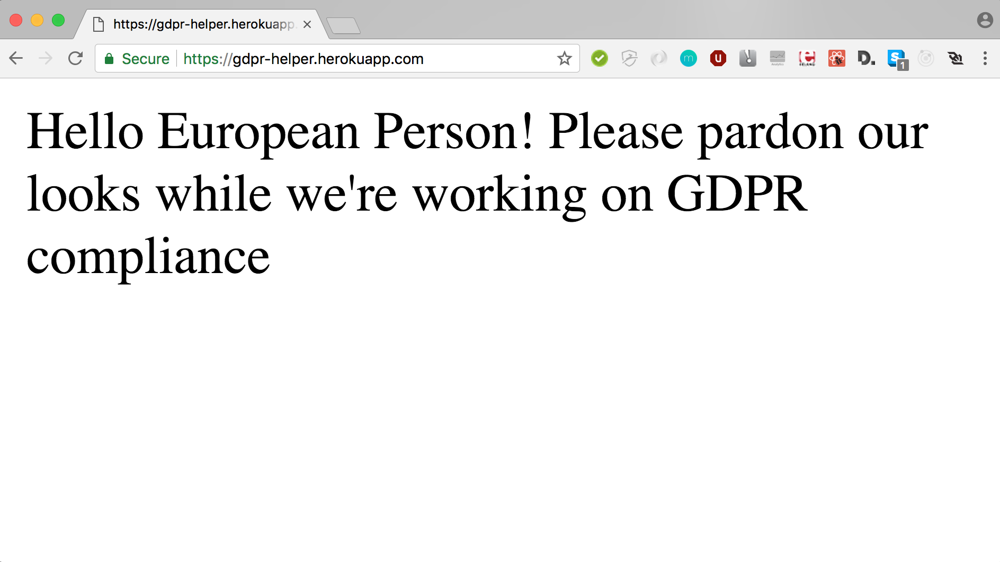
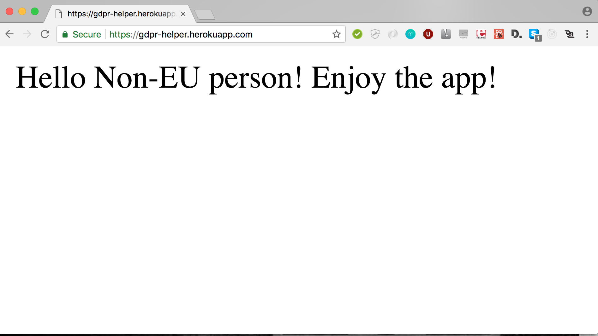

# gdpr-react-redux-starter
#### Not ready to face the [GDPR](https://www.eugdpr.org/) yet? Use this starter app as a quick solution! Render different content to EU residents (or a simple "sorry, we're working on it" screen). This app knows from which IP address the user is coming and will render the component accordingly. All you have to do is fill up the component!

## Built with
* Node.js
* Express.js
* React.js/Redux
* ES6
* uses free [ipinfo.io API](https://ipinfo.io/). Consider getting the API token if you expect more than 1000 hits a day.
## Getting started
1. Clone and install
```
$ git clone https://github.com/Nukki/gdpr-react-redux-starter.git starter
$ cd starter
$ npm install
```
2. Run each command in a **separate terminal window**
```
$ npm run start-watch
```

```
$ npm run build-watch
```
## About Components

There are three components in `app/components/` you should pay attention to.
* `MainContainer.js` decides which child to render. Feel free to style it
* `EuropeanHome.js` is where components(code) for EU residents will go
* `RegularHome.js` is where components(code) for non-EU users will go


## Demo

### Here is what you will see after deplying this app on heroku:

1. Connect from IP address that belongs to EU

***
***
2. Connect from IP address outside of EU 

